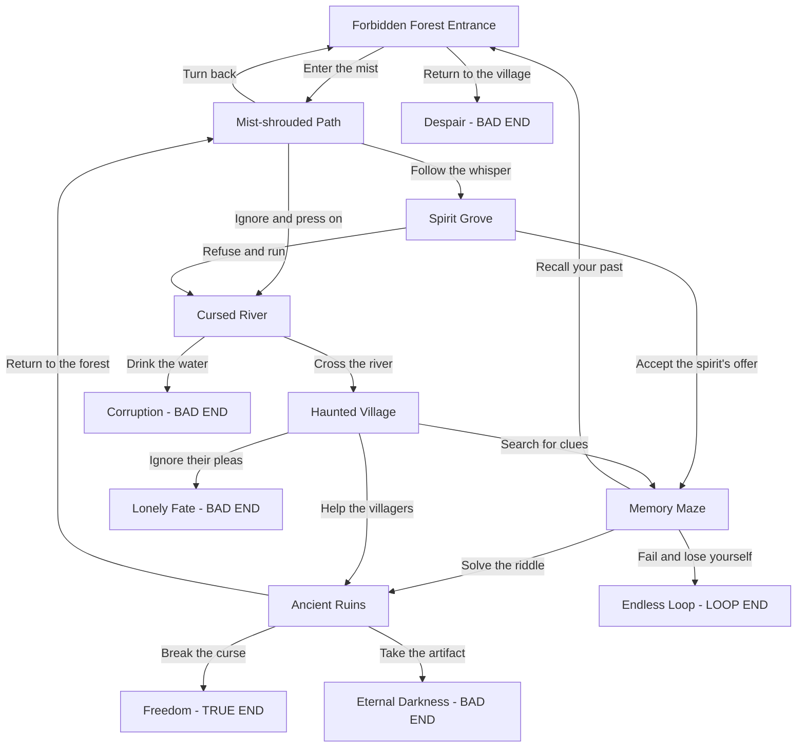
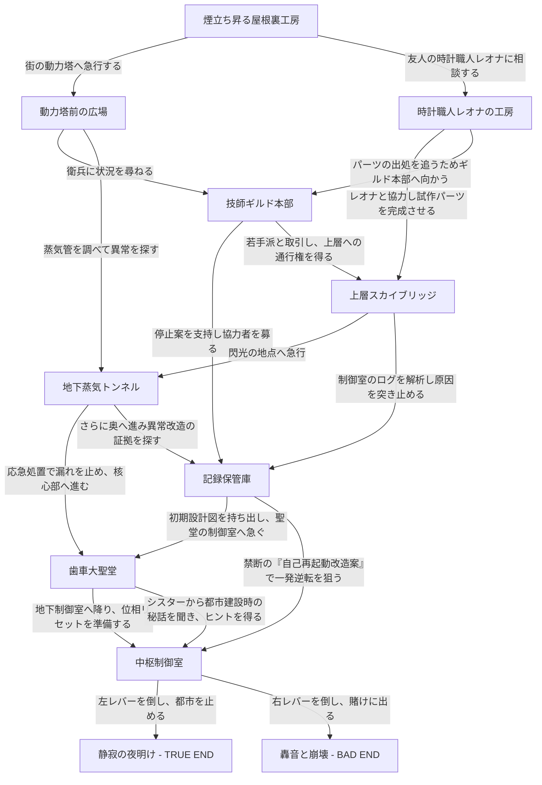
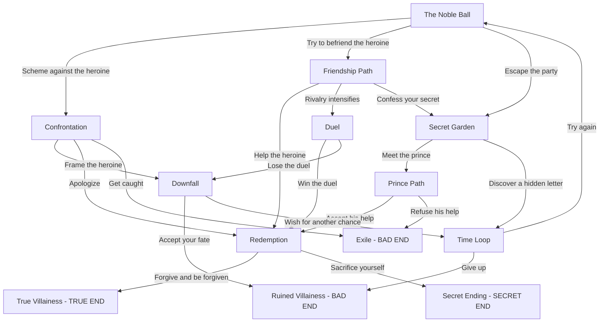
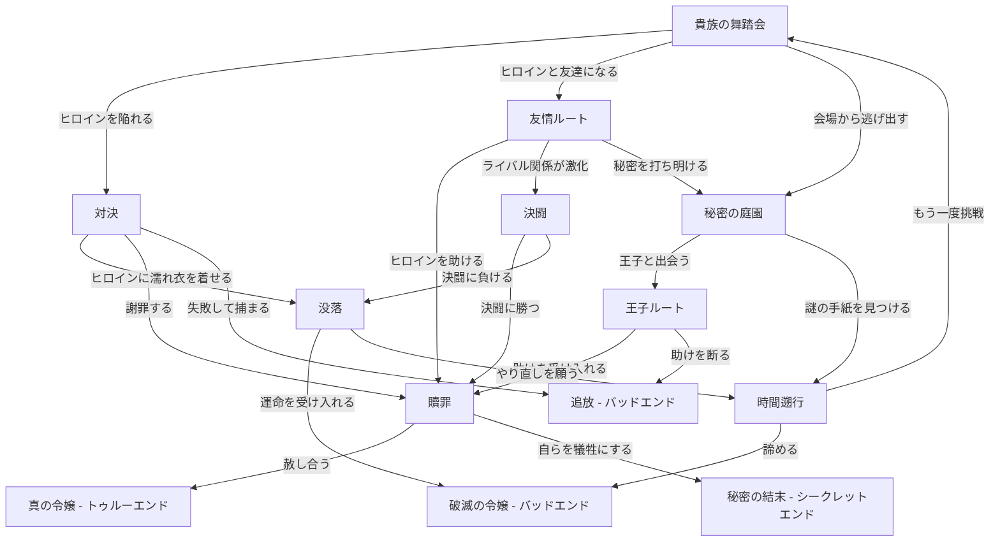

## Dark Fantasy Scenario Tree: Forbidden Forest

- Each node corresponds to a YAML scenario file in `stories/dark_forest/`.
- The scenario features complex branches, loops, and multiple endings.

## 歯車仕掛けの都市

- Each node corresponds to a YAML scenario file in `stories/clockwork_city/`.
- The scenario features complex branches, loops, and multiple endings.

## Villainess Reversal: The Rose of Ruin

- Each node corresponds to a YAML scenario file in `stories/villainess_rose/`.
- The scenario features multiple endings, loops, and dramatic reversals.

## 悪役令嬢転生譚 ～薔薇と運命の輪～

- Each node corresponds to a YAML scenario file in `stories/villainess_rose_ja/`.
- The scenario features multiple endings, loops, and dramatic reversals.

